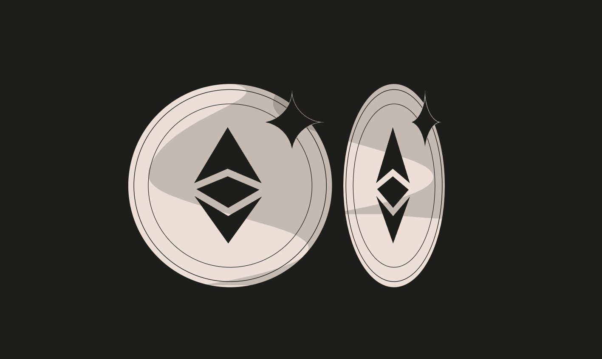

### Token
* Difficulty：★★☆☆☆
* The goal of this level is for you to hack the basic token contract below.
* You are given 20 tokens to start with and you will beat the level if you somehow manage to get your hands on any additional tokens.
* Preferably a very large amount of tokens.

---------------------------------------------------------------------------------------------------------

### 代币
* 难度：★★☆☆☆
* 本关卡目标是破解下方的基础代币合约。
* 初始状态下你将获得 20 枚代币，若能以某种方式获取额外代币（最好是大量代币），即可完成本关卡。

