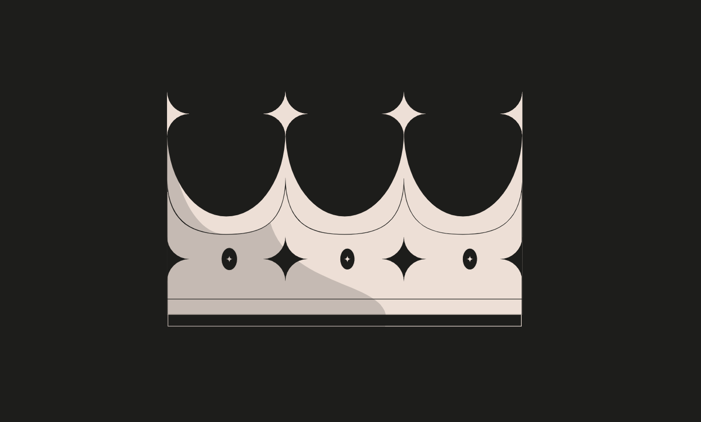

### King
* Difficulty：★★★☆☆
* The contract below represents a very simple game: whoever sends it an amount of ether that is larger than the current prize becomes the new king. On such an event, the overthrown king gets paid the new prize, making a bit of ether in the process! As ponzi as it gets xD
* Such a fun game. Your goal is to break it.
* When you submit the instance back to the level, the level is going to reclaim kingship. You will beat the level if you can avoid such a self proclamation.

---------------------------------------------------------------------------------------------------------

### 国王
* 难度：★★★☆☆
* 下方合约代表一个非常简单的游戏：任何人发送的以太币数量超过当前奖金，就能成为新国王。发生这种情况时，被推翻的国王会获得新奖金，过程中还能赚点以太币！简直就是庞氏骗局的套路 xD
* 多么有趣的游戏。你的目标是破解它。
* 当你将合约实例提交回关卡时，关卡会试图重新夺回国王头衔。若你能阻止这种「自动加冕」，即可完成本关卡。

