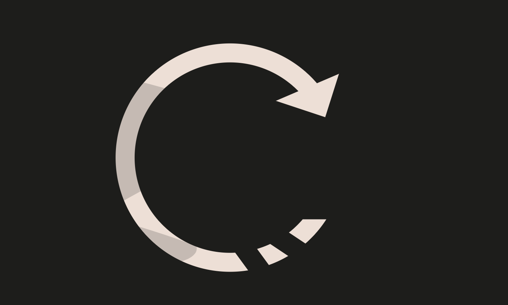

### Recovery
* Difficulty：★★★☆☆
* A contract creator has built a very simple token factory contract.
* Anyone can create new tokens with ease.
* After deploying the first token contract, the creator sent 0.001 ether to obtain more tokens. They have since lost the contract address.
* This level will be completed if you can recover (or remove) the 0.001 ether from the lost contract address.

---------------------------------------------------------------------------------------------------------

### 恢复
* 难度：★★★☆☆
* 某合约创建者开发了一个极其简易的代币工厂合约。
* 任何人都能轻松创建新代币。
* 部署首个代币合约后，该创建者向其转入了 0.001 以太币以获取更多代币，但此后遗失了该合约地址。
* 若你能从这个遗失的合约地址中找回（或取走）这 0.001 以太币，即可完成本关卡。

