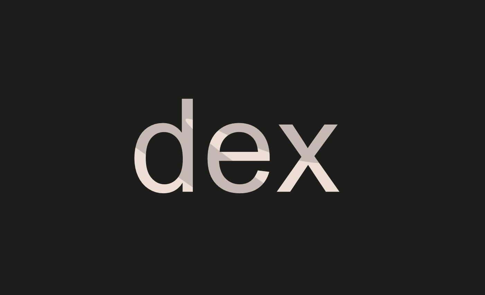

### Dex
* Difficulty：★★☆☆☆
* The goal of this level is for you to hack the basic DEX contract below and steal the funds by price manipulation.
* You will start with 10 tokens of token1 and 10 of token2. The DEX contract starts with 100 of each token.
* You will be successful in this level if you manage to drain all of at least 1 of the 2 tokens from the contract, and allow the contract to report a "bad" price of the assets.
* Quick note：
  * Normally, when you make a swap with an ERC20 token, you have to approve the contract to spend your tokens for you. 
  * To keep with the syntax of the game, we've just added the approve method to the contract itself. 
  * So feel free to use `contract.approve(contract.address, <uint amount>)` instead of calling the tokens directly, and it will automatically approve spending the two tokens by the desired amount. 
  * Feel free to ignore the SwappableToken contract otherwise.

---------------------------------------------------------------------------------------------------------

### 去中心化交易所
* 难度：★★☆☆☆
* 本关卡的目标是利用价格操纵手段攻击下方的基础 DEX 合约并盗取资金。
* 初始状态下，你将持有 10 枚 token1 代币和 10 枚 token2 代币，而 DEX 合约初始各持有 100 枚这两种代币。
* 若你能成功耗尽合约中至少一种代币的全部余额，并使合约报出资产的“异常”价格，即可完成本关卡挑战。
* 温馨提示：
    * 通常，当你使用 ERC20 代币进行交换时，必须授权合约代表你花费你的代币。
    * 为了符合游戏的语法规范，我们已直接在合约中添加了授权（approve）方法。
    * 因此，你可以直接使用 `contract.approve(contract.address, <uint 金额>)`，无需直接调用代币合约，该方法会自动授权合约按指定金额花费这两种代币。
    * 除此之外，你可以忽略 SwappableToken 合约。

