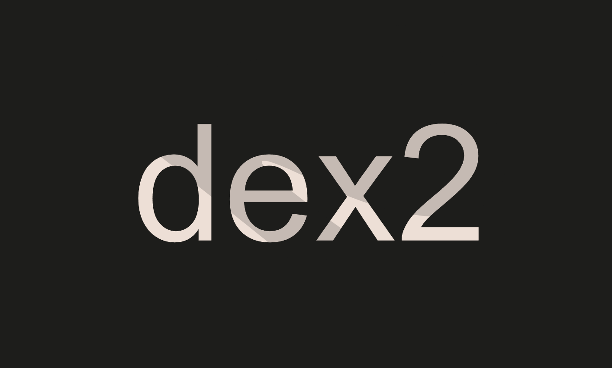

### Dex Two
* Difficulty：★★☆☆☆
* This level will ask you to break DexTwo, a subtly modified Dex contract from the previous level, in a different way.
* You need to drain all balances of token1 and token2 from the DexTwo contract to succeed in this level.
* You will still start with 10 tokens of token1 and 10 of token2. The DEX contract still starts with 100 of each token.

---------------------------------------------------------------------------------------------------------

### 去中心化交易所二号
* 难度：★★☆☆☆
* 本关卡要求你以另一种方式攻破 DexTwo 合约——该合约是上一关卡中 Dex 合约的微调版本。
* 你需要耗尽 DexTwo 合约中 token1 和 token2 的全部余额，方可完成本关卡挑战。
* 初始状态下，你仍将持有 10 枚 token1 代币和 10 枚 token2 代币，而 DEX 合约初始也仍各持有 100 枚这两种代币。

