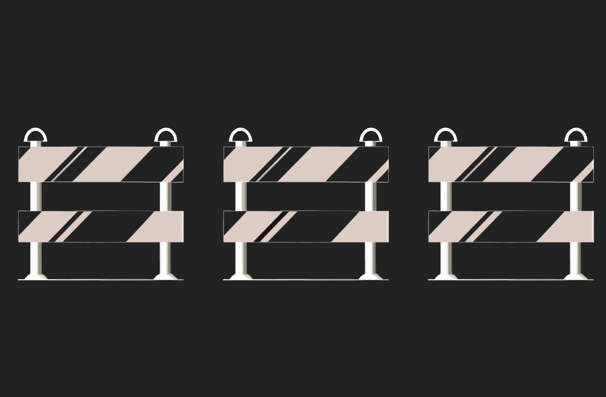

### Gatekeeper Three
* Difficulty：★★★☆☆
* Cope with gates and become an entrant.
* Things that might help:
  - Recall return values of low-level functions.
  - Be attentive with semantic.
  - Refresh how storage works in Ethereum.

---------------------------------------------------------------------------------------------------------

### 守卫者三号
* 难度：★★★☆☆
* 突破所有关卡（gates），成为准入者（entrant）。
* 以下几点或许能帮到你：
  - 回顾底层函数的返回值相关知识。
  - 留意语义细节。
  - 重新梳理以太坊中存储的工作机制。
