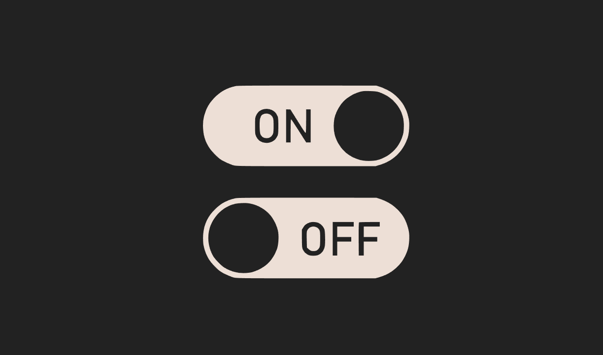

### Switch
* Difficulty：★★★★☆
* Just have to flip the switch. Can't be that hard, right?
* Things that might help:
  - Understanding how CALLDATA is encoded.
---------------------------------------------------------------------------------------------------------

### 开关
* 难度：★★★★☆
* 只需拨动开关即可。应该没那么难，对吧？
* 可能有帮助的要点：
  - 理解 CALLDATA 的编码方式。
