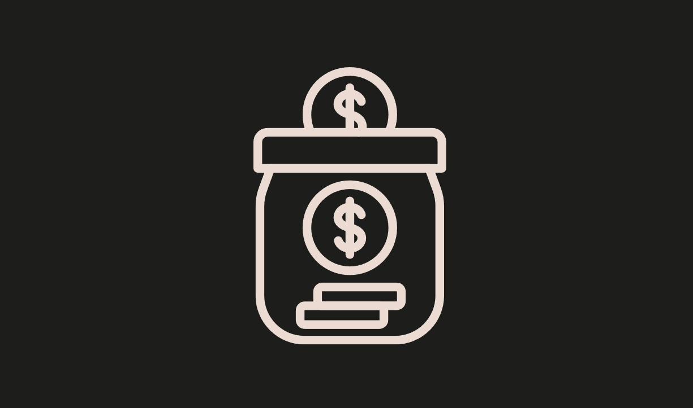

### Stake
* Difficulty：★★★☆☆
* Stake is safe for staking native ETH and ERC20 WETH, considering the same 1:1 value of the tokens. Can you drain the contract?
* To complete this level, the contract state must meet the following conditions:
  - The Stake contract's ETH balance has to be greater than 0.
  - totalStaked must be greater than the Stake contract's ETH balance.
  - You must be a staker.
  - Your staked balance must be 0.

---------------------------------------------------------------------------------------------------------

### 质押合约
* 难度：★★★☆☆
* 考虑到原生ETH与ERC20标准WETH代币具有1:1的等值关系，该合约支持安全质押这两种资产。你能否掏空该合约？
* 完成本关卡需满足以下合约状态条件：
  - 质押合约（Stake）的ETH余额必须大于0。
  - 总质押量（totalStaked）必须大于质押合约（Stake）的ETH余额。
  - 你必须是质押者（staker）。
  - 你的质押余额必须为0。
