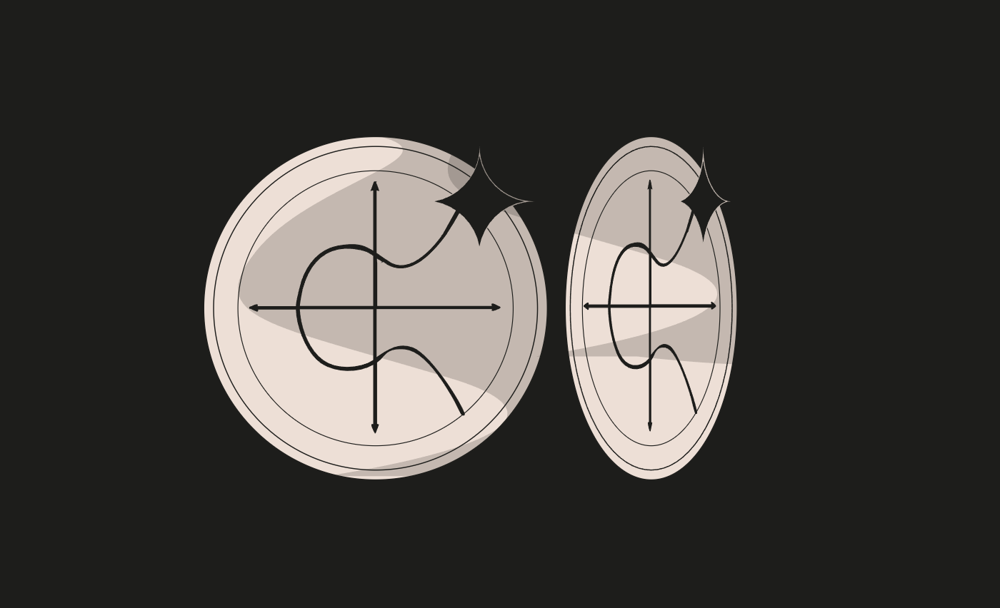

### Elliptic Token
* Difficulty：★★★★☆
* BOB created and owns a new ERC20 token with an elliptic curve–based signed voucher redemption system called EllipticToken ($ETK). 
* Bob can create vouchers off-chain that can be redeemed on-chain for $ETK. The contract also includes a permit system based on elliptic curve signatures.
* Bob is a lazy developer and “optimized” some steps of the ECDSA algorithm. Can you find the flaw?
* Your goal is to steal the $ETK tokens that ALICE (0xA11CE84AcB91Ac59B0A4E2945C9157eF3Ab17D4e) just redeemed.
* Things that might help:
  - Look for any missing step in the Elliptic Curve Digital Signature Algorithm (ECDSA).
  - Good luck. Elliptic curves do not forgive domain confusion.

---------------------------------------------------------------------------------------------------------

### 椭圆代币
* 难度：★★★★☆
* 鲍勃（BOB）创建并持有一种新的ERC20代币，该代币带有基于椭圆曲线的签名凭证兑换系统，名为椭圆代币（$ETK）。
* 鲍勃可在链下生成凭证，这些凭证能在链上兑换为$ETK代币。该合约还包含一个基于椭圆曲线签名的授权系统。
* 鲍勃是个偷懒的开发者，他对椭圆曲线数字签名算法（ECDSA）的部分步骤进行了“优化”。你能找出其中的漏洞吗？
* 你的目标是盗取艾丽斯（ALICE，钱包地址：`0xA11CE84AcB91Ac59B0A4E2945C9157eF3Ab17D4e`）刚兑换的$ETK代币。
* 可能有帮助的提示：
    - 留意椭圆曲线数字签名算法（ECDSA）中是否存在遗漏的步骤。
    - 祝你好运。椭圆曲线可不会容忍域混淆的错误。
