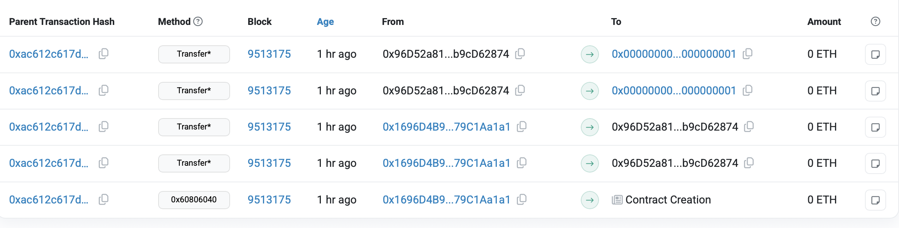
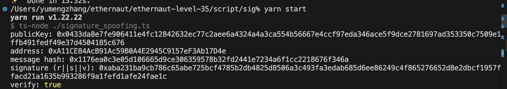

# Ethernaut Level 35 EllipticToken

---

> “Do not be overcome by evil, but overcome evil with good.” — Romans 12:21

In this game, we have to steal all the tokens that Alice (`0xA11CE84AcB91Ac59B0A4E2945C9157eF3Ab17D4e`) just redeemed.

Contract:

```solidity
// SPDX-License-Identifier: MIT
pragma solidity 0.8.28;

import {Ownable} from "openzeppelin-contracts-08/access/Ownable.sol";
import {ECDSA} from "openzeppelin-contracts-08/utils/cryptography/ECDSA.sol";
import {ERC20} from "openzeppelin-contracts-08/token/ERC20/ERC20.sol";

contract EllipticToken is Ownable, ERC20 {
    error HashAlreadyUsed();
    error InvalidOwner();
    error InvalidReceiver();
    error InvalidSpender();

    constructor() ERC20("EllipticToken", "ETK") {}

    mapping(bytes32 => bool) public usedHashes;

    function redeemVoucher(
        uint256 amount,
        address receiver,
        bytes32 salt,
        bytes memory ownerSignature,
        bytes memory receiverSignature
    ) external {
        bytes32 voucherHash = keccak256(abi.encodePacked(amount, receiver, salt));
        require(!usedHashes[voucherHash], HashAlreadyUsed());

        // Verify that the owner emitted the voucher
        require(ECDSA.recover(voucherHash, ownerSignature) == owner(), InvalidOwner());

        // Verify that the receiver accepted the voucher
        require(ECDSA.recover(voucherHash, receiverSignature) == receiver, InvalidReceiver());

        // Nullify the voucher
        usedHashes[voucherHash] = true;

        // Mint the tokens
        _mint(receiver, amount);
    }

    function permit(uint256 amount, address spender, bytes memory tokenOwnerSignature, bytes memory spenderSignature)
        external
    {
        bytes32 permitHash = keccak256(abi.encode(amount));
        require(!usedHashes[permitHash], HashAlreadyUsed());
        require(!usedHashes[bytes32(amount)], HashAlreadyUsed());

        // Recover the token owner that emitted the permit
        address tokenOwner = ECDSA.recover(bytes32(amount), tokenOwnerSignature);

        // Verify that the spender accepted the permit
        bytes32 permitAcceptHash = keccak256(abi.encodePacked(tokenOwner, spender, amount));
        require(ECDSA.recover(permitAcceptHash, spenderSignature) == spender, InvalidSpender());

        // Nullify the permit
        usedHashes[permitHash] = true;

        // Approve the spender
        _approve(tokenOwner, spender, amount);
    }
}
```

### Contract Analysis

Each voucher, which contains the receiver's information, is hashed and that message hash is signed off-chain by both the token owner (Bob) and the receiver (Alice). After on-chain validation with `ECDSA.recover`, if both validations pass, the receiver will get the signed amount of tokens.

Then in `permit` function, `tokenOwner` and `spender` will also be verified by their signatures for token allowances.

Since Alice has a balance of the Elliptic token (ETK) greater than 0, `redeemVoucher()` must have been called at least once (with Alice being the receiver), and there *must be* some traces about it. However, because the contract has a mapping `usedHashes`, we cannot use the signature (or *impersonator*) to infiltrate with that *exact same* message hash.

This contract seems impeccable. So how can we make the attack possible? If we take a deeper look at the `permit` function, we will find something really strange:

In code line `address tokenOwner = ECDSA.recover(bytes32(amount), tokenOwnerSignature);`, the recover function does not take in the **hashed** message! Instead, it takes in a `bytes32(amount)` as a "message hash" directly without any actual encryption processes. It is not a conventional move.

So how can we take advantage of this vulnerability? Let's first leave this question here to see what we can do for the first step.

### voucherHash & Alice's signature

`redeemVoucher()` must have been called once. We can use this transaction hash to look up for more information such as the **input information** in Sepolia Etherscan, potentially getting the trace of the public `voucherHash` and Alice's signature for this message hash.

If we go to the instance's address page, then go to the internal transactions tab, we will see something like this:



The last two transactions, which are from the level's address to the address(1), are the transactions that we want to notice, since when we are calling an `ECDSA.recover()`, we will make a static call to the *precompile* , which is located exactly at address(1). For more information of the *precompile*, you can check [this link](https://lucasmartincalderon.medium.com/exploring-precompiled-contracts-on-ethereum-a-deep-dive-4e9f9682e0aa). Also, [ethernaut level 32 Impersonator](https://ethernaut.openzeppelin.com/) has a low-level implementation of `ecrecover`.

So, the *last* transaction represents `require(ECDSA.recover(voucherHash, receiverSignature) == receiver, InvalidReceiver());` code line, where `ECDSA.recover` is called after being called once before for the verification of the owner (Bob). If we check the calldata, we should see that `(voucherHash, receiverSignature)` encoded.

Input:

```
0x87f1c8cd4c0e19511304b612a9b4996f8c2bd795796636bd25812cd5b0b6a973000000000000000000000000000000000000000000000000000000000000001cab1dcd2a2a1c697715a62eb6522b7999d04aa952ffa2619988737ee675d9494f2b50ecce40040bcb29b5a8ca1da875968085f22b7c0a50f29a4851396251de12
```

So the `voucherHash` is `0x87f1c8cd4c0e19511304b612a9b4996f8c2bd795796636bd25812cd5b0b6a973` and Alice's signature is `0xab1dcd2a2a1c697715a62eb6522b7999d04aa952ffa2619988737ee675d9494f2b50ecce40040bcb29b5a8ca1da875968085f22b7c0a50f29a4851396251de121c`. Note that I put v (0x1c) to the end so that recovery function can take in correct input order (r, s, v).

There is also another way to find these two inputs (a little bit cheating way). Go to the source code of Ethernaut, then go to the level factory file ([EllipticTokenFactory.sol](https://github.com/OpenZeppelin/ethernaut/blob/master/contracts/src/levels/EllipticTokenFactory.sol)), we can directly see these two `bytes` variables in the `createInstance` function.

### Alice's Public Key

Now that we have the (message hash, signature) pair, we can recover Alice's public key. See this formula:
$$
P = r^{-1} (sR - zG)
$$

- `r`: derived from the x-coordinate of the curve point used to generate signature.
- `s`: calculated based on secret value used in the signature generation process and the message hash.
- `R`: point that can be found on curve using x-coordinate `r` value.
- `z`: message hash.
- `G`: the generation point.

You can also check whether the calculated public key is correct by `Keccak-256` it and see whether the last 20 bytes of the result is Alice's address. Use this [Keccak256 calculator](https://emn178.github.io/online-tools/keccak_256.html).

### Signature Validation

In order to move on to the next part, there're some background knowledge for *signature validation* process in Elliptic Cryptography. Assume that we already have the public key `P` , signature (r, s) and message hash `z`. How can we validate the signature?

- Calculate $u_1 = s^{-1}z\mod n$, and $u_2 = s^{-1} r \mod n$.
- Calculate $Q = u_1G + u_2P$, and if $r == x(Q)\mod n$, signature is valid.

This validation method is based on how signature (r, s) is calculated given `P`, private key `e`, secret value `k`, and message hash `z`. For more information about ECDSA, refer to [this source](https://en.wikipedia.org/wiki/Elliptic_Curve_Digital_Signature_Algorithm).

### Signature Spoofing

Now we can answer the question left: how can we take advantage of *this* vulnerability (unhashed message hash)? Well, the answer is **signature spoofing**.

In signature spoofing, we use a public key and a public (signature/message hash) pair to *forge* a (signature/message hash) pair that was **not** created by the original signer. We can simply make `u1` and `u2` random to generate as many pairs as possible. Now that we have the forged message hash, since that `bytes32(amount)` is not hashed at all, it is extremely susceptible to **brute force** attack with *many* forged pairs. Here is the step-by-step approach:

1. Public key recovery using the known signature and message hash ($P = r^{-1}(sR-zG)$).
2. Randomly choose `0 <= u1 < n` and `0 < u2 < n`. (`u2 != 0` since we need to calculate its inverse).
3. $Q = u_1G + u_2P$, $r' = x(Q)\mod n$, ($r' \neq 0$).
4. Calculate $u_2^{-1} \mod n = u_2Inv$, $s = r * u_2Inv \mod n$. ($s' \neq 0$).
5. Decide $v$ with $y(Q)$, $r'$, $s'$.
6. $z = (u_1 * s \mod n)$.
7. Compare `z` directly with Alice's balance (10 ether). If it is larger than that, it means we can pretend that Alice had permitted us this amount. If it is smaller than 10 ether, choose a different (`u1`, `u2`) pair and go from step 3 again.

`signature_spoofing.ts`:

```typescript
import {
  bytesToBigInt,
  recoverPublicKey,
  serializeSignature,
  toHex,
  verifyHash,
  type Hex,
} from "viem";
import { publicKeyToAddress } from "viem/accounts";
import { secp256k1 } from "@noble/curves/secp256k1.js";
import { randomBytes } from "crypto";


const N = BigInt(
  "0xfffffffffffffffffffffffffffffffebaaedce6af48a03bbfd25e8cd0364141",
);

// ---------- helpers ----------

/// @notice Computes `a mod m` as a non-negative bigint.
/// @dev Fixes JavaScript’s `%` remainder operator, which can return negative values.
///      Returns `r` such that `0 <= r < m` and `r ≡ a (mod m)`.
/// @param a The dividend (can be negative).
/// @param m The modulus (must be positive and non-zero).
/// @return The canonical positive remainder of `a` modulo `m`.
function mod(a: bigint, m: bigint): bigint {
  const r = a % m;
  return r >= 0n ? r : r + m;
}

/// @notice Computes the modular inverse of `a` modulo `m`.
/// @dev Uses the Extended Euclidean Algorithm to find `x` such that `(a * x) % m == 1`.
///      Requires that `a` and `m` are coprime; otherwise, no inverse exists.
/// @param a The value to invert.
/// @param m The modulus (must be positive and non-zero).
/// @return The modular inverse of `a` modulo `m`.
function invMod(a: bigint, m: bigint): bigint {
  let t = 0n, newT = 1n;
  let r = m, newR = mod(a, m);
  while (newR !== 0n) {
    const q = r / newR;
    [t, newT] = [newT, t - q * newT];
    [r, newR] = [newR, r - q * newR];
  }
  if (r !== 1n) throw new Error("Inverse does not exist");
  if (t < 0n) t += m;
  return t;
}

/// @notice Generates a random scalar value in the range `[1, N-1]`.
/// @dev Uses cryptographically secure random bytes to produce a valid scalar for elliptic curve operations.
///      Ensures the scalar is non-zero and uniformly distributed modulo `N`.
/// @return A random bigint `s` such that `1 <= s < N`.
function randomScalar(): bigint {
  while (true) {
    const rb = randomBytes(32);
    const k = bytesToBigInt(rb);
    const s = mod(k, N - 1n) + 1n; // 1..n-1
    if (s !== 0n) return s;
  }
}

/// @notice Demonstrates a signature spoofing routine.
/// @dev Recovers the public key from a given `(hash, signature)` pair and performs
///      elliptic curve operations to derive related parameters. This example is for
///      educational or defensive use only; it should not be used for generating or
///      modifying signatures in production code.
/// @param hash The signed message hash (32-byte value).
/// @param signature The existing ECDSA signature corresponding to `hash`.
/// @return pubkeyHex The recovered uncompressed public key as a hex string.
/// @return r The x-coordinate of the resulting curve point.
/// @return s The calculated signature parameter in canonical form.
/// @return v The Ethereum-style recovery ID (27 or 28).
/// @return e The computed auxiliary message hash value.
/// @return signature The serialized `(r, s, v)` signature in hex format.
async function signatureSpoofing({
  hash,
  signature,
}: {
  hash: Hex;
  signature: Hex;
}) {
    // Recover public key (should be uncompressed)
    const pubkeyHex = await recoverPublicKey({
        hash,
        signature,
    });

    // build P from pubkey
    const P = secp256k1.Point.fromHex(pubkeyHex.slice(2));
    const G = secp256k1.Point.BASE;

    while (true) {
        // random u1 and u2 
        const u1 = randomScalar();
        const u2 = randomScalar();
        if (u2 === 0n) continue; // u2 must be non-zero since we need to compute its inverse

        // Q = u1*G + u2*P
        const Q = G.multiply(u1).add(P.multiply(u2));
        const {x, y} = Q.toAffine();
        const r = mod(x, N);
        if (r === 0n) continue; // r must be non-zero since it is part of the signature

        const u2Inv = invMod(u2, N); // calculate inverse of u2 (u2Inv = 1/u2 mod N)
        let s = mod(r * u2Inv, N); // s = r/u2 mod N
        if (s === 0n) continue; // s must be non-zero since it is part of the signature

        let yParity = Number(y & 1n);
        // Enforce low-S canonical form
        if (s > N / 2n) {
        s = N - s;
        yParity ^= 1; // flip parity because we negated s
        }
        const v = 27 + yParity; // Ethereum-style v

        // calculate msgHash: z = (u1 * s) mod N = (u1 * (r/u2 mod N)) mod N
        const z = mod(r * mod(u1 * u2Inv, N), N);

        if (z < 10 ** 18) continue; // ensure z is higher than Alice's balance

        // serialize signature
        const generatedSignature = serializeSignature({
            r: toHex(r),
            s: toHex(s),
            v: BigInt(v),
        });

        return {
            pubkeyHex,
            r,
            s,
            v,
            z,
            signature: generatedSignature,
        };
    }
}

async function main() {
    const hash =
        "0x87f1c8cd4c0e19511304b612a9b4996f8c2bd795796636bd25812cd5b0b6a973";
    const signature =
        "0xab1dcd2a2a1c697715a62eb6522b7999d04aa952ffa2619988737ee675d9494f2b50ecce40040bcb29b5a8ca1da875968085f22b7c0a50f29a4851396251de121c";

    const out = await signatureSpoofing({ hash, signature });

    const pubkeyHex = out.pubkeyHex;
    const address = publicKeyToAddress(pubkeyHex);
    const messageHash = toHex(out.z);
    const serializedSignature = out.signature;

    console.log("publicKey:", pubkeyHex);
    console.log("address:", address); // 0xA11CE84AcB91Ac59B0A4E2945C9157eF3Ab17D4e (alice)
    console.log("message hash:", messageHash);
    console.log("signature (r||s||v):", serializedSignature);
    console.log(
        "verify:",
        await verifyHash({
            hash: messageHash,
            signature: serializedSignature,
            address,
        }),
    );
}

main().catch((err) => {
    console.error(err);
    process.exit(1);
});

```

This script is referenced from [here](https://github.com/piatoss3612/Ethernaut/blob/main/script/signature_spoofing.ts). We run this script with yarn and have the output:



Then we can copy the message hash and signature in our Solidity script:

`EllipticToken.s.sol`:

```solidity
// SPDX-License-Identifier: MIT
pragma solidity 0.8.28;

import {Script, console} from "forge-std/Script.sol";
import {IEllipticToken} from "../src/IEllipticToken.sol";

contract EllipticTokenScript is Script {
    address tokenAddress = 0x96D52a815b56d80890bdC627458d623b9cD62874;
    address tokenOwner = 0xA11CE84AcB91Ac59B0A4E2945C9157eF3Ab17D4e;
    IEllipticToken token = IEllipticToken(tokenAddress);

    function run() external {
        vm.startBroadcast();
        uint256 amount = uint256(0x1176ea0c3e05d106665d9ce306359578b32fd2441e7234a6f1cc2218676f346a);
        bytes memory tokenOwnerSignature = 
            hex"aba231ba9cb786c65abe725bcf4785b2db4825d8506a3c493fa3edab685d6ee86249c4f865276652d8e2dbcf1957ffacd21a1635b993286f9a1fefd1afe24fae1c";

        bytes32 permitAcceptHash = keccak256(abi.encodePacked(tokenOwner, msg.sender, amount));
        (uint8 v, bytes32 r, bytes32 s) = vm.sign(msg.sender, permitAcceptHash);
        bytes memory spenderSignature = abi.encodePacked(r, s, v);

        token.permit(amount, msg.sender, tokenOwnerSignature, spenderSignature);
        bool success = token.transferFrom(tokenOwner, msg.sender, token.balanceOf(tokenOwner));
        require(success, "Transfer failed");

        console.log("Alice's ETK balance:", token.balanceOf(tokenOwner));
        vm.stopBroadcast();
    }
}
```

Note that we can use cheat code `vm.sign` in foundry to sign a message with EOA. For the entire code base, you can check here:

[Github-link-for-solution](https://github.com/EEexplorer001/ethernaut-level-35-elliptic-token)
