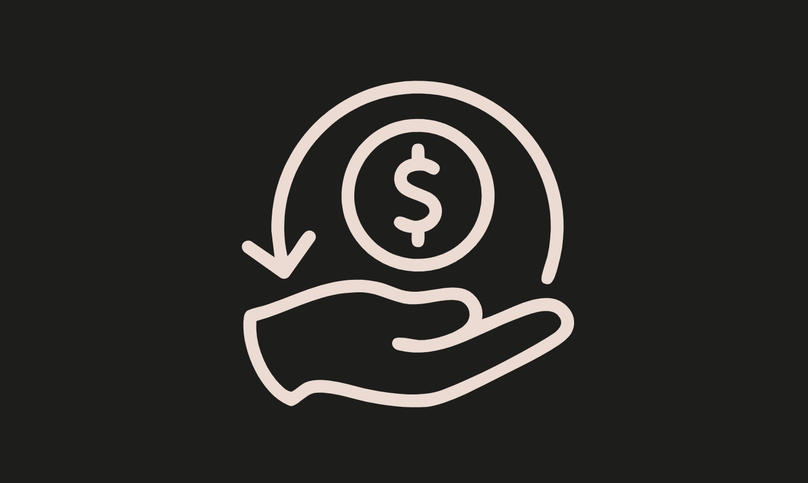

### Cashback
* Difficulty：★★★★☆
* You’ve just joined Cashback, the hottest crypto neobank in town. 
* Their pitch is irresistible: for every on-chain payment you make, you earn points. 
* Rack up enough and you’ll reach legendary status, unlocking the coveted Super Cashback NFT badge.
* The system leverages EIP-7702 to allow EOAs to accrue cashback. Users must delegate to the Cashback contract to use the payWithCashback function.
* Rumor has it there’s a back door for power users. 
* Your brief is simple: become the loyalty program’s nightmare. 
* Max out your cashback in every supported currency and walk away with at least two Super Cashback NFT, one of which must correspond to your player address.

---------------------------------------------------------------------------------------------------------

### 返现奖励
* 难度：★★★★☆
* 你刚刚加入了城中最热门的加密数字银行Cashback。
* 他们的宣传极具吸引力：每笔链上支付均可赚取积分。
* 累计足够积分即可解锁"传奇等级"，获得备受追捧的超级返现NFT徽章（Super Cashback NFT badge）。
* 该系统基于EIP-7702标准实现，允许外部拥有账户（EOA）累积返现奖励。用户需将账户委托给Cashback合约，方可使用payWithCashback函数。
* 有传言称，该系统为特权用户预留了后门。
* 你的任务很简单：成为忠诚度计划的"噩梦"。
* 最大化所有支持币种的返现额度，并至少获取两枚超级返现NFT，其中一枚必须与你的玩家地址对应。
