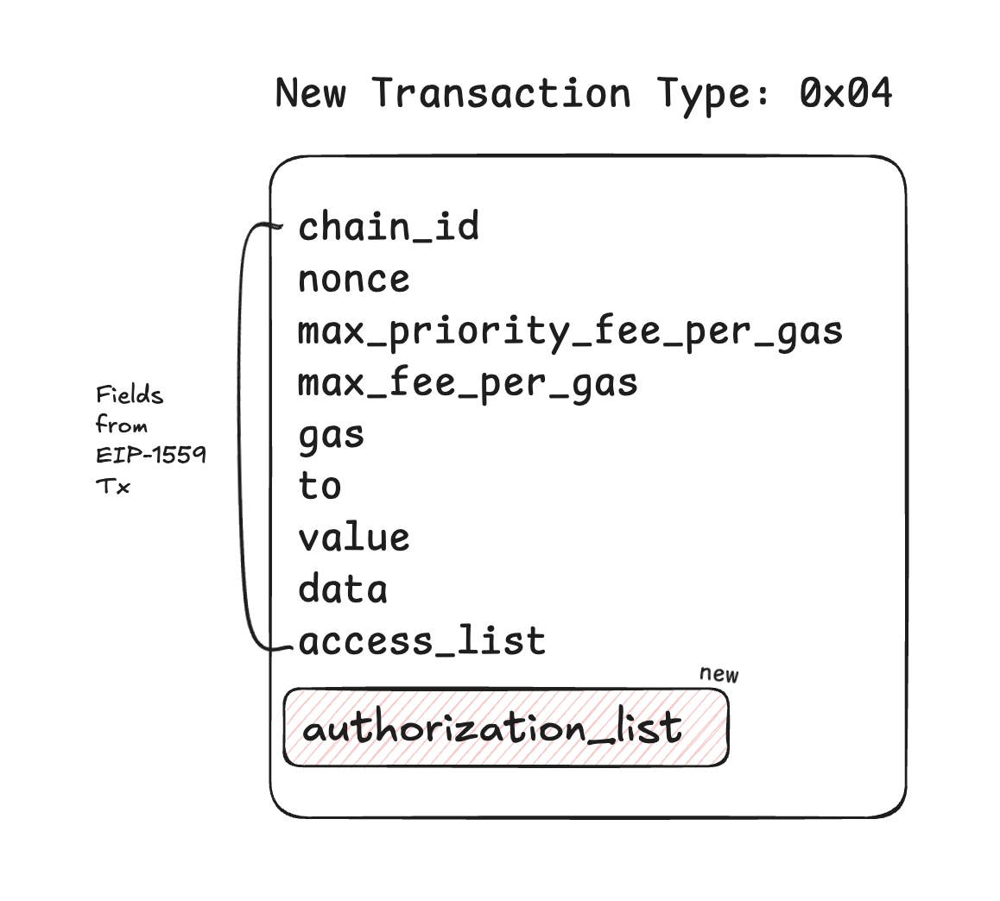
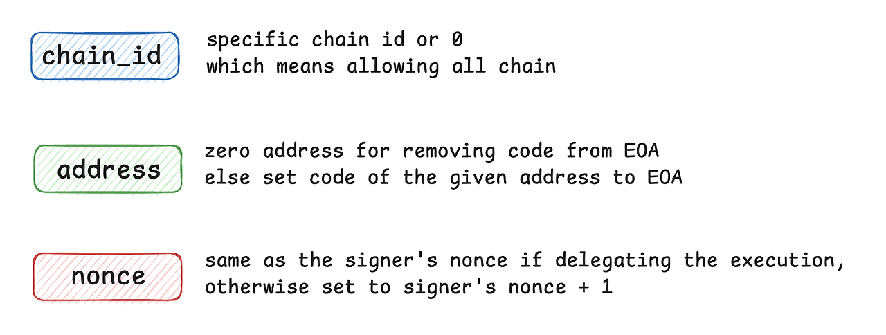
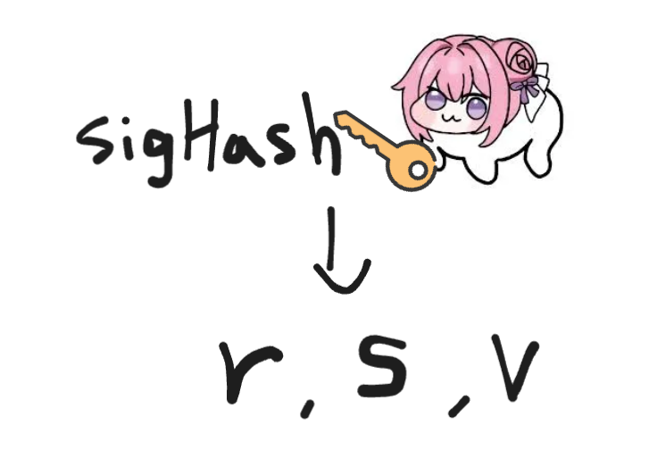
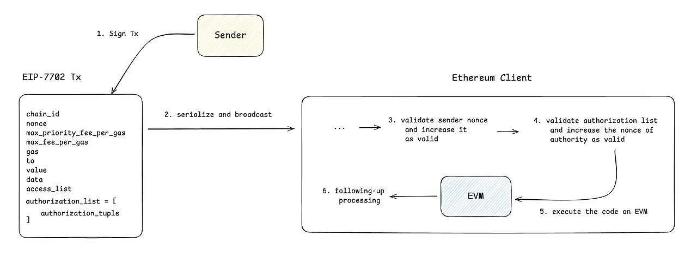
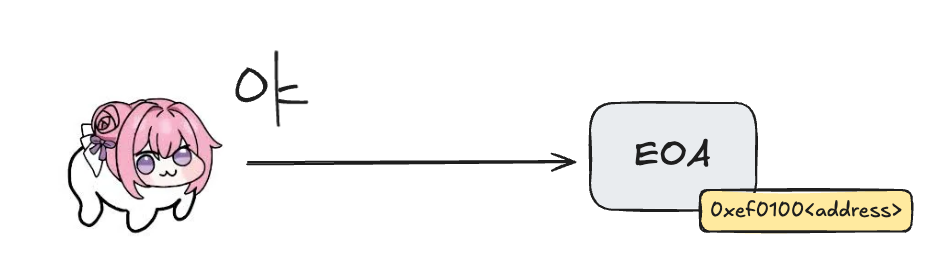
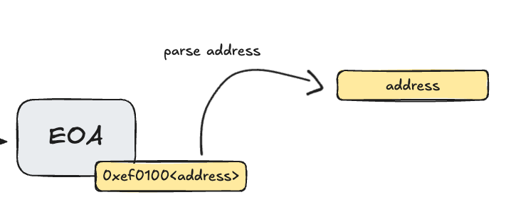
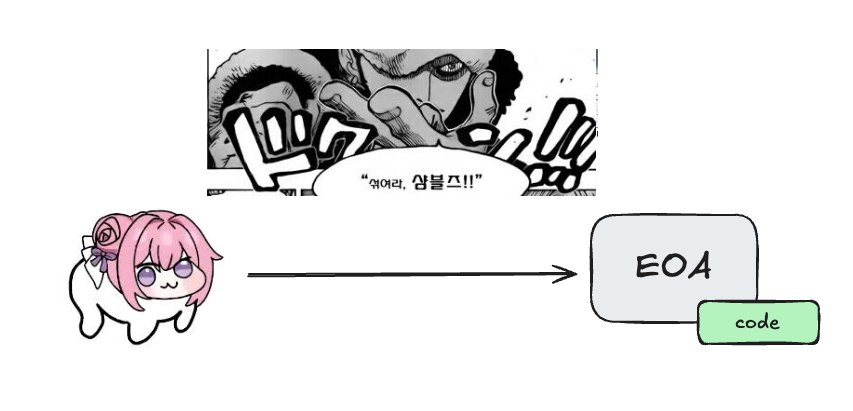

# EIP-7702 Set Code For EOAs

#### **들어가기 전에...**

이더리움의 계정 추상화에 대해 먼저 간략하게 살펴보시면 이 글을 이해하는 데 도움이 됩니다.

[2024.04.22 - \[블록체인/Ethereum\] - ERC-4337: 계정 추상화 - 간단 정리](https://piatoss3612.tistory.com/167)

___

## **등장 배경**

EIP-7702는 지난 5월 초에 이루어진 이더리움 펙트라 업그레이드에 포함된 업그레이드 스펙 중 하나로, 비탈릭 부테린이 20분 만에 초안을 작성했다는 전설이 전해지고 있습니다. 비탈릭이 우수한 두뇌를 가지고 있는 것도 사실이지만, 한 생태계의 리더가 이렇게 긴박하게 초안을 작성한 데에는 뭔가 피비린내 나는 뒷배경이 있을지도 모른다는 암시를 내포하고 있죠. 실제로도 EIP-3074와 ERC-4337 두 진영 간의 키보드 배틀이 있었습니다.

EIP-3074에 대해서는 이미 폐기 처분된 제안이기도 하고 제가 콘텍스트가 부족하긴 한데 간략하게 설명을 드리면,

-   AUTH, AUTHCALL이라는 새로운 opcode를 evm에 추가
-   EOA는 해당 opcode를 사용해  invoker라는 스마트 컨트랙트에게 권한을 부여
-   invoker는 EOA에게 부여받은 권한을 통해 스마트 컨트랙트 수준의 다양한 요구사항을 처리

**EOA 기반의 기능성 확장**이 EIP-3074의 주목적이라고 볼 수 있습니다.

대의명분은 납득이 되지만, EOA 기반의 기능 확장은 기존 이더리움 생태계에서 **계정 추상화, ERC-4337이 내비친 방향성 - EOA의 스마트 계정으로의 완전한 전환** - 과 방향 자체가 상당히 어긋난 것으로 보입니다. 비탈릭이 이를 가만히 지켜보고 있을 수는 없었겠죠. ERC-4337은 자신의 의지 그 자체였으니까요. 그리고 새로운 opcode를 가상머신에 추가하는 것은 예상치 못한 사이드 이펙트를 발생시킬 수도 있으므로 정말 오랜 기간 테스트가 필요한 사항이기도 합니다. 

그렇게 비탈릭은 키보드를 잡고 무아지경의 상태로 두 진영이 모두 납득할 수 있을만한 EIP-7702의 초안을 휘갈겨 쓰게 됩니다.

___

## **EIP-7702 Core Concepts**

EIP-7702는 **EOA에 '코드'를 설정하는 새로운 트랜잭션 타입을 도입**하였습니다. 기존에는 스마트 컨트랙트만이 코드를 가질 수 있었지만, 이제 EOA도 코드를 가질 수 있게 됩니다. 그리고 이를 통해 EOA가 특정 주소의 코드를 자기 자신에게 위임(delegation)하도록 할 수 있으며, 이를 기반으로 다양한 기능(배치, 후원, 권한 제한 등)을 스마트 컨트랙트 수준에서 활용할 수 있습니다.

주요 콘셉트에 대해 하나씩 살펴보겠습니다.

### **1\. 새로운 트랜잭션 타입**

새로운 트랜잭션 타입인 **SetCodeTxType(0x04)**이 추가되었습니다.

```go
// Transaction types.
const (
LegacyTxType     = 0x00
AccessListTxType = 0x01
DynamicFeeTxType = 0x02
BlobTxType       = 0x03
SetCodeTxType    = 0x04
)
```

이 트랜잭션 타입은 EIP-1559, Dynamic Fee 트랜잭션과 동일한 필드를 공유하면서도, **AuthList(**authorization\_list**)**라는 새로운 필드를 가지고 있습니다. 그리고 이 새로운 필드는 빈 배열이어서는 안 됩니다. 왜냐하면 EIP-7702 트랜잭션(0x04 타입)을 실행한다는 것은, ‘EOA에 코드를 설정하거나 제거’한다는 명확한 의도가 포함되어야 하기 때문이죠.

```go
// SetCodeTx implements the EIP-7702 transaction type which temporarily installs
// the code at the signer's address.
type SetCodeTx struct {
ChainID    *uint256.Int
Nonce      uint64
GasTipCap  *uint256.Int // a.k.a. maxPriorityFeePerGas
GasFeeCap  *uint256.Int // a.k.a. maxFeePerGas
Gas        uint64
To         common.Address
Value      *uint256.Int
Data       []byte
AccessList AccessList
AuthList   []SetCodeAuthorization

// Signature values
V *uint256.Int
R *uint256.Int
S *uint256.Int
}
```



> 💡 주의: Dynamic Fee 트랜잭션 구조가 강제되므로, Legacy 트랜잭션 타입에서 사용되는 gasPrice는 사용할 수 없습니다.

### **2.  Authorization List**

Authorization List(이하 승인 리스트)는 **하나 이상의 Authorization Tuple**(이하 승인 튜플)로 구성되어 있습니다. 

```go
// SetCodeAuthorization is an authorization from an account to deploy code at its address.
type SetCodeAuthorization struct {
ChainID uint256.Int    `json:"chainId" gencodec:"required"`
Address common.Address `json:"address" gencodec:"required"`
Nonce   uint64         `json:"nonce" gencodec:"required"`
V       uint8          `json:"yParity" gencodec:"required"`
R       uint256.Int    `json:"r" gencodec:"required"`
S       uint256.Int    `json:"s" gencodec:"required"`
}
```

#### **2-1.  승인 튜플의 구성**

각 승인 튜플은 다음과 같이 구성됩니다.

-   **chain\_id**: 0 또는 EIP-7702 트랜잭션이 실행될 체인의 ID
-   **address**: EOA에 설정할 코드를 가진 **delegation 대상의 주소 (스마트 컨트랙트 주소)**
-   **nonce**: 코드 설정을 적용할 계정(EOA)의 논스
-   **v, r, s**: 승인 튜플의 콘텍스트에 대한 유효한 서명값

> 💡 주의: chain\_id가 0인 경우, 하나의 서명이 EIP-7702가 지원되는 서로 다른 체인에서 유효하게 처리됨으로 인한 리플레이 공격이 발생할 수 있습니다.

#### **2-2.  승인 튜플의 구성하는 방법**

DORO는 이더리움 메인넷에서 Alchemy의 Semi Modular Account 7702를 자신의 EOA에 설정하고자 합니다. DORO의 EOA는 트랜잭션을 한 번도 실행해보지 않은 계정이라고 가정합시다. 논스가 왜 사용되고 왜 1로 설정되어야 하는지는 3번 항목에서 설명드리겠습니다.

-   chain\_id: 1
-   address: 0x69007702764179f14F51cdce752f4f775d74E139
-   nonce: 1



준비된 값들을 도메인 구분자 역할을 하는 0x05 접두사와 함께 rlp 직렬화를 한 뒤, keccack256 함수를 사용해 서명 해시(sigHash)를 생성해 줍니다.

> keccack256(rlp(0x05, chain\_id, address, nonce)) = sigHash

그리고 DORO는 EOA의 비밀키로 서명 해시에 서명하여 서명값(r, s, v)을 생성합니다.



서명값 (r, s, v)와 앞서 준비한 chain\_id, address, nonce를 하나의 승인 튜플 '\[chain\_id, address, nonce, v, r, s\]'로 구성한 뒤, 승인 튜플을 승인 리스트에 추가해 주면 EIP-7702 트랜잭션을 실행할 준비가 된 것입니다.

> 💡 EOA에 설정된 코드를 제거하고 싶다면, address를 zero address(0x0000...0000)으로 지정하여 튜플을 구성하고 EIP-7702 트랜잭션을 실행해야만 합니다.

**▼ geth 코드로 살펴보는 승인 리스트 구성 방법**

### **3.  논스 처리**

원래는 트랜잭션 필드에만 EOA의 논스가 필요했는데, EIP-7702 트랜잭션은 승인 튜플에도 EOA의 논스가 들어가야만 합니다. 그래서 어떤 것이 우선적으로 검증되고 증가 처리가 되는지 순서를 분명하게 파악할 필요가 있습니다. 그런데 한 가지 또 복잡한 것은, **승인 튜플만 유효하면 제삼자가 대신해서 승인 리스트를 구성하고 EIP-7702 트랜잭션을 실행할 수 있다**는 것입니다. 그래서 우선은 통상적인 논스 증가 로직을 먼저 살펴보고 자세한 예시를 통해 제삼자가 대리 실행하는 과정을 설명드리겠습니다.

#### **3-1.  논스 증가 순서**

통상적인 논스 증가 순서는 다음과 같습니다.

1.  트랜잭션 실행 시, sender의 논스와 트랜잭션에 명시된 논스가 일치하는지 검증하고, 일치하면 sender의 논스를 1 증가시킵니다. 즉, 트랜잭션 필드에 명시된 논스가 먼저 처리되는 것이지요.
2.  이어서 승인 리스트의 각 승인 튜플에 대해 아래 검증 로직을 적용합니다.
    1.  튜플에 포함된 (chain\_id, address, nonce)를 사용해 sigHash를 재구성하고, 이 sigHash와 서명값 (r, s, v)를 입력으로 ecrecover를 호출해 서명자의 주소 'authority'를 복원합니다.
    2.  authority 계정의 현재 논스와 승인 튜플에 명시된 nonce가 일치하는지 검증하고, 일치하면 authority 계정의 논스를 1 증가시킵니다.
    3.  검증이 완료되면 EOA에 코드가 부착되거나 제거됩니다. **이때 부착되는 코드를 ‘위임 지정자’**라고 하며 이는 4번 항목에서 설명드리겠습니다.



이처럼 트랜잭션의 논스가 먼저 처리되고, 승인 리스트의 각 튜플에 명시된 논스가 앞에서부터 순차적으로 처리가 됩니다. 순서가 엄격하게 정해져 있으므로 EOA에 코드를 설정하고 트랜잭션을 실행한 뒤에 코드를 제거하는 등의 복잡한 작업은 현재로서는 불가능합니다. 또한 하나의 EOA로 여러 개의 승인 튜플을 구성해 코드를 여러 번 설정하더라도 최종적으로 검증에 통과한 승인 튜플이 가리키는 address의 코드 단 하나만이 EOA 설정되게 됩니다.

> 💡 승인 리스트를 검증하는 과정에서 일부 튜플의 검증에 실패하더라도 다른 요소들의 검증 결과에는 영향을 미치지 않습니다. 즉, 검증에 성공한 튜플만 적용되고 나머지는 무효화됩니다.

#### **3-2.  CASE 1: DORO가 직접 EIP-7702 트랜잭션을 실행하는 경우**

1.  **초기 상태 설정**
    -   DORO의 EOA 현재 논스가 0이라고 가정합니다.
    -   승인 리스트에는 DORO의 EOA에 코드를 설정하기 위한 튜플(논스는 1)이 하나 들어있습니다.
2.  **트랜잭션 검증 및 처리**
    -   클라이언트는 먼저 트랜잭션에 명시된 논스(0)가 DORO의 실제 논스와 일치하는지 검증합니다.
    -   일치하면 DORO의 EOA 논스가 0에서 1로 증가합니다.
3.  **승인 리스트 처리**
    -   이어서 트랜잭션에 포함된 승인 리스트의 각 승인 튜플에 대해 검증을 진행합니다.
    -   각 승인 튜플에서는 현재 DORO의 EOA 논스(1)와 튜플에 명시된 논스가 일치해야 합니다.
    -   일치하면 DORO의 EOA 논스가 1에서 2로 증가하며, 위임 지정자가 EOA에 설정됩니다.
4.  **결과**
    -   EIP-7702 트랜잭션의 실행 결과, DORO의 EOA 논스는 2가 되고, 위임 지정자가 EOA에 설정됩니다.

#### **3-3.  CASE 2: DORO가 지휘관에게 EIP-7702 트랜잭션 실행 대리를 맡기는 경우**

1.  **초기 상태**
    -   DORO의 EOA 현재 논스는 2라고 가정합니다.
    -   지휘관의 EOA 논스는 7이라고 가정합니다.
    -   DORO는 승인 튜플(논스는 2)을 구성해 지휘관에게 전달한 상태입니다.
    -   지휘관은 DORO의 승인 튜플을 승인 리스트에 포함하여 EIP-7702 트랜잭션을 실행합니다.
2.  **트랜잭션 검증 및 처리**
    -   클라이언트는 트랜잭션에 명시된 논스(7)가 지휘관의 실제 논스와 일치하는지 검증합니다.
    -   일치하면 지휘관의 EOA 논스가 7에서 8로 증가합니다.
3.  **승인 리스트 처리**
    -   이후 트랜잭션에 포함된 승인 리스트의 각 승인 튜플에 대해 검증을 진행합니다.
    -   DORO의 승인 튜플에 명시된 논스(2)가 DORO의 EOA 현재 논스(2)와 일치해야 합니다.
    -   일치하면 DORO의 EOA 논스가 2에서 3으로 증가합니다.
    -   만약 추가로 HONG의 승인 튜플이 포함되어 있다면, HONG의 EOA 논스에 대해 동일한 검증 과정을 거칩니다.
4.  **결과**
    -   지휘관이 제출한 트랜잭의 논스가 EOA 실제 논스와 일치하여, 지휘관의 EOA 논스는 7에서 8로 증가합니다.
    -   트랜잭션에 포함된 DORO의 승인 튜플이 검증되어, DORO의 EOA 논스는 2에서 3으로 증가합니다.
    -   추가로 HONG의 승인 튜플이 처리된 경우, HONG의 EOA 논스도 증가합니다.

#### **3-3.  새로운 논스 증가 로직의 영향 정리**

|      **영향**      |                                                                  **설명**                                                                   |
|--------------|---------------------------------------------------------------------------------------------------------------------------------------|
| 트랜잭션과 승인 분리  | 승인 튜플 생성자(EOA)와 EIP-7702 트랜잭션의 sender가 분리되어, 서로 다른 계정에서 승인 튜플을 집계하고 배치 승인(batch authorization)을 실행할 수 있으며, 수수료 후원 등 유연한 거래 방식이 가능합니다. |
|  개발 복잡성 증가   |                                     새로운 논스 메커니즘 구현으로 인해 SDK나 지갑 서비스 개발 시 논스 처리에 대한 복잡도가 증가하였습니다.                                      |
| 대리 승인 악용 가능성 |            악의적인 스마트 컨트랙트 주소에 대해 사용자의 승인을 집계한 후 대리 승인, 대리 승인을 통해 사용자 계정에 설정된 악의적인 스마트 컨트랙트를 실행하고 자금을 인출하는 등의 악용 위험이 증가했습니다.            |

### **4.  위임 지정**

#### **4-1.  위임 지정(Delegation Designation)이란?**

위임 지정은 EIP-3541에서 금지된 opcode 0xef를 사용하여, 특정 코드가 특별한 용도로 사용됨을 표시하는 방법입니다. 여기서 특별한 용도라 함은, EIP-7702 트랜잭션을 통해 EOA에 설정되는 코드와 깊은 연관이 있습니다.

앞서 승인 튜플의 검증에 통과하여 EOA에 부착되는 코드를 '위임 지정자'라고 했습니다. 이 위임 지정자는 접두사 0xef0100와 인증 튜플에 명시된 address를 이어 붙인, 0xef0100<address> 23바이트 크기의 코드입니다. 이 코드는 한 번 EOA에 설정되고 나면 제거되기 전까지는 반영구적으로 지속됩니다.


#### **4-2.  위임 지정자의 동작**

위임 지정자는 가상 머신의 실행 콘텍스트로 들어가기 전에, 지정된 주소(address)에서 실행 가능한 코드를 불러와 EOA에 할당하는 포인터 역할을 수행합니다. 이로 인해 CALL, CALLCODE, STATICCALL, DELEGATECALL과 같은 **실행 명령어들은 위임 지정자가 가리키는 주소의 코드를 실행**하게 됩니다.

한 편, EXTCODESIZE, EXTCODECOPY, EXTCODEHASH와 같은 코드 읽기 명령어들은 위임 지정자 자체(0xef0100 || address)만을 대상으로 처리됩니다.

만약 위임 지정자가 precompile 주소를 가리키면, 해당 주소에서 불러온 코드는 빈 코드로 간주되며, 관련 실행 명령어들이 (충분한 가스가 제공되면) 빈 코드를 실행해 성공한다.

위임 지정자가 다른 지정자를 가리켜 체인이나 루프(포인터의 포인터)를 형성하는 경우, 클라이언트는 최초의 위임 지정자에 해당하는 코드만 검색하고 이후의 지정자 체인은 따라가지 않는다.

> 💡 자세한 내용은 다음 글에서 Foundry 테스트와 함께 검증해 봅시다.

#### **4-3.  가상 머신 실행 콘텍스트에 돌입하기 전...**

DORO가 위임 지정자 코드가 붙어있는 EOA를 호출하는 트랜잭션을 실행한다고 가정해 봅시다.



트랜잭션 검증 단계에서 이더리움 클라이언트는 먼저 EOA의 위임 지정자를 파싱 하여 address를 가져옵니다.



그리고 드럼통(state db)에서 주소가 가리키고 있는 code를 찾아와 EOA에 임시로 부착합니다.


검증 로직이 종료되고 EVM 실행 콘텍스트에 진입하게 되면, DORO가 실제로 호출하는 코드는 위임 지정자가 아닌 위임 지정자가 가리키는 address의 코드가 됩니다. 물론 코드의 실행은 address가 아닌 EOA의 콘텍스트에서 처리됩니다. 예를 들어, 유니스왑 v3 라우터의 코드를 EOA에 부착했다고 해서 유니스왑 v3 라우터가 기존에 가지고 있던 스토리지 정보를 참조할 수 없으며 이 코드는 온전히 EOA의 스토리지 정보 위에서 동작하게 됩니다. 왜냐하면 우리가 가져온 코드는 단순한 로직 레이어일 뿐, 완전히 다른 저장 공간을 참조하고 있기 때문입니다.



> 💡 EOA에 설정된 코드는 언제든지 대체/변경이 가능하므로 Upgradeable Smart Contract와도 공통분모를 가지고 있습니다. 로직 레이어와 스토리지 레이어가 분리되어 있으므로 스토리지 사용에 주의해야 합니다.

___

## ****정리****

|               항목               |                                                          요약                                                           |                       중요 포인트 / 보안 영향                       |
|--------------------------------|-----------------------------------------------------------------------------------------------------------------------|------------------------------------------------------------|
|           **새 트랜잭션 타입**            |                    SetCodeTxType (0x04) — EIP-7702 전용. Dynamic Fee 구조(1559)와 동일한 필드 + AuthList 포함.                    |         AuthList는 빈 배열 불가. legacy gasPrice 사용 불가.          |
|       **승인 리스트 (AuthList)**        |                                     SetCodeAuthorization 튜플들의 배열 — 하나 이상의 튜플 필요.                                      |      튜플만 유효하면 제3자(리레이어 등)가 대신 제출 가능 → 대리 실행/스폰서링 위험.       |
|         **승인 튜플 구조 & 서명**          |             (chain\_id, address, nonce, v, r, s)sigHash = keccak256( rlp(0x05, chain\_id, address, nonce) )             | chain\_id = 0이면 여러 체인에서 리플레이 가능(위험). 튜플은 EOA 비밀키로 서명되어야 함. |
|            **논스 처리 순서**            | 1) 트랜잭션의 nonce 검증 → sender의 nonce 증가2) 승인 리스트의 튜플들 순차 검증: 각 튜플의 nonce == authority의 현재 nonce → 맞으면 authority nonce 증가 |  트랜잭션 논스가 먼저 처리됨. 튜플의 순서가 중요(앞→뒤). 일부 튜플 실패 시 성공한 튜플만 적용.  |
|    **대리 제출(Third-party relay)**    |                                 승인 튜플 생성자(권한자)와 tx sender 분리 가능 — 즉, 다른 계정이 모아서 제출 가능                                 |        배치 승인, 수수료 스폰서링 가능하지만 악용(악성 컨트랙트 설정) 위험 증가.         |
| **위임 지정자(Delegation Designation)** | EOA에 실제로 붙는 코드: \`0xef0100<address>\`  
실제 코드를 가진 컨트랙트 주소를 가리키는 포인터 |                                                            |
|         **실행 컨텍스트 & 스토리지**         |                            불러온 코드는 **EOA의 실행 컨텍스트/스토리지** 위에서 동작 — 원본 contract의 스토리지는 참조하지 않음.                             |             로직/스토리지 분리 → 교체 가능하지만 스토리지 충돌 주의.              |
|             **코드 제거**              |                                          address = 0x000...0 인 튜플로 제출하면 제거됨.                                          |                   제거 동작도 승인 튜플 제출로 제어됨.                    |

___

## **스마트 계정으로의 완전한 마이그레이션, 그 과도기**

지금까지 EIP-7702의 핵심 콘셉트를 살펴보았습니다. EOA에 ERC-4337 스마트 계정의 코드를 설정하게 되면 기존의 ERC-4337과의 호환성을 확보하면서도 EOA 그 자체의 기능 확장을 통해 EIP-3074 진영도 만족시킬 수 있는 아주 멋들어진 제안이라고 생각됩니다. 물론 3074 진영에서 정말로 만족해서 타협한 것인지, 비탈릭한테 침묵 스킬 맞고 조용해진 것인지는 의문입니다만.

지금 이 시점은 어떻게 보면 중요한 과도기라고 생각됩니다. 현재 EOA에 스마트 계정을 설정하여 사용하더라도 여전히 EOA의 프라이빗 키 또는 스마트 계정의 P256, BLS 등의 서명 방식에 따른 별도의 키가 필요합니다. EOA의 비밀키는 여전히 EOA에 대한 완전한 권한을 가지고 있지요. 이는 오히려 공격 지점이 EOA와 스마트 계정 두 갈래로 늘어나서 키 유출에 따른 보안적인 위험을 더 가중시킨 것으로도 보입니다.

완전한 스마트 계정 전환을 위해서는 프로토콜 차원에서 EOA와 매핑된 개인키를 일시적 또는 영구적으로 무효화할 수 있는 방안이 필요해 보입니다. 물론 이것이 이더리움이라는 블록체인 내지 생태계만 이 세상에 존재한다면 말이 되지만, 지갑 써본 분은 아시지만 코스모스나 비트코인 같은 다른 생태계에서도 동일한 비밀키를 사용하는 경우가 대부분입니다. 과연 사용자가 비밀키를 돌려쓰는 편의성을 버리고, 스마트 계정을 위한 키를 별도로 추가하고 관리할 것인가? 비탈릭과 친구들은 과연 어떤 방안을 강구해 낼까요?

#### **관련 EIP**

-   [https://eips.ethereum.org/EIPS/eip-7377](https://eips.ethereum.org/EIPS/eip-7377)
-   [https://eips.ethereum.org/EIPS/eip-7701](https://eips.ethereum.org/EIPS/eip-7701)
-   [https://eips.ethereum.org/EIPS/eip-7851](https://eips.ethereum.org/EIPS/eip-7851)

___

## **마치며**

사내 발표 자료로 3월 말에 준비를 했던 것을 리마스터 버전으로 다시 작성해 보았습니다. 근데 뭔 표준 하나 이해하는데 이렇게 복잡하고 많은 내용이 필요한지... 아직 보여드리지 않은 내용이 더 많습니다. 나는 그 당시 이 자료를 도대체 어떻게 준비한 것이고... 이래서 web3 개발자가 부족하지.

___

## **참조**

-   [https://github.com/ethereum/go-ethereum/pull/30078](https://github.com/ethereum/go-ethereum/pull/30078)
-   [https://eip.tools/eip/7702](https://eip.tools/eip/7702)
-   [https://safe.global/blog/eip-7702-smart-accounts-ethereum-pectra-upgrade](https://safe.global/blog/eip-7702-smart-accounts-ethereum-pectra-upgrade)
-   [https://hackmd.io/@colinlyguo/SyAZWMmr1x](https://hackmd.io/@colinlyguo/SyAZWMmr1x)
