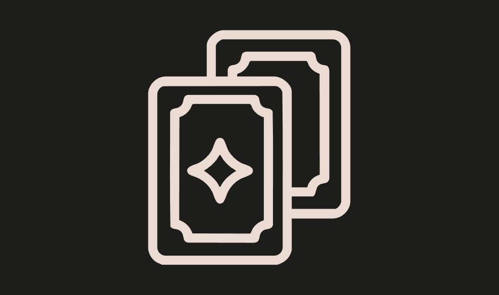

### UniqueNFT
* Difficulty：★★★☆☆
* Welcome to UniqueNFT, where any user can get its very own shiny digital badge.
* Humans with EOAs? You mint for free, no questions asked. Proof of Humanity for the win!
* Smart contracts? Sorry bots, pay the toll –> one whole ether!
* But here’s the twist: one badge per address, no greedy hoarding allowed.
* And forget about trading, these things stick like glue.
* It’s like blockchain tattoos, once it’s yours, it’s yours forever.
* Think you can outsmart the rules and own more a single NFT? Prove it.

---------------------------------------------------------------------------------------------------------

# 专属非同质化代币
* 难度：★★★☆☆
* 欢迎来到专属非同质化代币平台，在这里，每位用户都能拥有专属于自己的精美数字徽章。
* 拥有外部拥有账户（EOA）的用户？铸造全免费，无需任何附加条件。人性证明机制，就是这么给力！
* 智能合约账户？抱歉了，机器人，想铸造就得付费——整整1个以太币！
* 但规则有个小限制：一个地址只能拥有一枚徽章，杜绝囤积居奇的贪婪行为。
* 更别想着交易流转，这些徽章会与你牢牢绑定。
* 它们就像区块链上的纹身，一旦归你所有，便永远属于你。
* 你觉得自己能钻规则空子，拥有一枚以上的非同质化代币？有本事就试试看。
